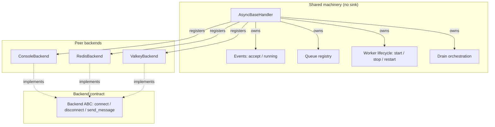

# Architecture Review

**Repository:** `scietex.logging` (v0.2.0)
**Date:** 2026-09-04
**Scope:** Deep architectural review of the full repository.
**Method:** All six source modules, tests, config, CI, examples, and the prior
architectural map (`docs/architecture/`) were read and cross-verified against
source. Line references below cite the actual source files.

---

## Executive Summary

The architecture is **fundamentally sound at the layering level** and is a
small, coherent, working package. Its strongest aspects are real and worth
preserving:

- A **strict, one-way, acyclic import graph** (`formatter` → `basic_handler` →
  `message_broker_handler` → `{redis, valkey}` → `__init__`). No circular
  dependencies.
- **Third-party client dependencies are confined to leaf backend modules**
  behind guarded imports; the core (`AsyncBaseHandler`) depends only on the
  stdlib and its own formatter.
- A clean **producer/consumer split**: synchronous `emit()` fans records into
  per-backend `asyncio.Queue`s; asynchronous workers drain them. This is the
  right shape for non-blocking logging.
- A sensible **extension seam**: new backends subclass `AsyncBrokerHandler`
  and implement `connect`/`disconnect`/`send_message`.

The weaknesses are **concentrated in one component**: `AsyncBaseHandler`
(`basic_handler.py`) is a multi-responsibility core that owns queue registry,
worker lifecycle, put-task bookkeeping, the console backend *and* backend-aware
shutdown orchestration. Several correctness and reliability defects follow
directly from this concentration and from two cross-cutting design decisions:
(1) the **same mutable `LogRecord` object is fanned into every backend queue**
and then mutated by the formatter, and (2) **errors in the async data path are
silently swallowed**, so the library can drop logs without any signal.

There are **no CRITICAL findings** — the package works for its documented
primary use case (single-threaded asyncio app, console + one broker, start
once / stop once at shutdown). There are **six HIGH findings** that represent
genuine correctness, reliability, and lifecycle defects, plus several MEDIUM
maintainability/extensibility issues.

**What should be fixed first:** the silent data-loss paths (AR-003, AR-004)
and the shared-mutable-record race (AR-002), because they corrupt or drop the
library's core output. The structural refactor of `AsyncBaseHandler` into
shared machinery + a real console backend (AR-001) is the highest-leverage
change and should be planned alongside them.

---

## Architecture Assessment

### Boundaries
Module boundaries are clean and dependency direction is correct. The core
never imports a backend; backends import the core. The one boundary violation
is that the **console backend is implemented inside the base class** rather
than as a peer backend, so the "backend" abstraction is not uniform — console
is privileged and special-cased throughout `stop_logging`.

### Responsibilities
Responsibility assignment is the weakest dimension. `AsyncBaseHandler`
(`basic_handler.py`) simultaneously owns: formatter construction, accept/running
event flags, the queue registry, the worker-coroutine registry, worker task
creation, put-task tracking and cleanup, the console backend implementation,
and the backend-aware shutdown sequence. This is a god-class in miniature and
is the root cause of several findings below.

### Dependencies
Excellent. Acyclic, one-way, third-party clients confined to leaves. The only
dependency smell is the duplicated optional-import guard (module-level raise +
package-level catch) and the `valkey-glide` version skew between `tox.ini`
(2.2.0) and `pyproject.toml` (2.5.0).

### Abstractions
The `AsyncBrokerHandler` extension seam is the right idea but is **enforced by
convention only** — `connect`/`disconnect`/`send_message` are no-op base
methods, and `AsyncBrokerHandler` is concrete and instantiable yet silently
drops every message. There is no `abc.ABC`/`abstractmethod` enforcement, so a
subclass that forgets to override `send_message` fails silently.

### Lifecycle
The worker lifecycle is **single-use and not restartable**. Worker coroutines
are created once in `__init__` and consumed by `asyncio.create_task` in
`start_logging`; `stop_logging` calls `self.close()`. A second
`start_logging()` raises `RuntimeError` ("cannot reuse already awaited
coroutine"). Handlers are effectively terminal after one start/stop cycle.

### Concurrency
The producer/consumer split is sound, but the concurrency boundary has real
defects: `emit()` is synchronous and calls `asyncio.create_task` (requires a
running loop in the calling thread), fans the **same mutable record** into all
queues, and swallows every exception. Workers mutate shared state (the record)
via the formatter while other workers read it.

### State Ownership
State is owned by the handler instance, which is reasonable, but the **shared
`LogRecord` is mutated by the formatter** (`formatter.py:103-106`) while broker
workers read the same fields (`message_broker_handler.py:109-118`) — an
implicit, unowned ordering dependency between formatting and dict-building.

### Testability
The core is testable in isolation (unit tests exist for `AsyncBaseHandler` and
the formatter). The broker backends are only tested **end-to-end against live
Redis/Valkey** (`tests/test_redis_handler.py`, `tests/test_valkey_handler.py`),
so the `_worker` drain logic and the `connect`/`send_message` seam have no
unit-level coverage with a fake client. The silent-drop and race defects are
therefore untested and invisible.

### Extensibility
Adding a backend is easy in the happy path (subclass + 3 methods) but the
configuration plumbing is ad hoc: backends receive config as raw `**kwargs`
with magic string keys (`stdout_enable`, `queue_put_cleanup_threshold`) and
raw dicts / client objects. There is no typed configuration or dependency
injection, so cross-cutting concerns (backpressure, retry, error policy) cannot
be added uniformly.

---

## Strengths

These are genuine, verified design decisions that should be preserved:

1. **Strict one-way acyclic import graph.** `formatter` → `basic_handler` →
   `message_broker_handler` → `{redis, valkey}` → `__init__`. No circular
   dependencies; the dependency direction always points from concrete backend
   toward shared core. This is the single best property of the codebase.

2. **Third-party clients confined to leaf modules behind guarded imports.**
   `redis_handler.py:3-9` and `valkey_handler.py:3-9` isolate the optional
   dependencies. The core (`AsyncBaseHandler`) imports only stdlib + its own
   formatter, so the base package has zero runtime dependencies.

3. **Producer/consumer decoupling.** Synchronous `emit()` (`basic_handler.py:115`)
   only enqueues; asynchronous workers drain. This is the correct shape for
   non-blocking logging and keeps the logging call path off the event loop's
   critical work.

4. **Event-based lifecycle signaling.** `logging_accept_event` /
   `logging_running_event` (`basic_handler.py:85-86`) cleanly separate "accept
   new records" from "workers are active", enabling the drain-then-stop
   sequence.

5. **Graceful shutdown intent.** `stop_logging` waits for queues to drain with
   a configurable timeout and reports per-backend completion/timeout status
   onto the console path (`basic_handler.py:152-235`). The *intent* is good
   even though the implementation is entangled (AR-009).

6. **Clean extension seam shape.** Subclassing `AsyncBrokerHandler` and
   implementing `connect`/`disconnect`/`send_message` is a low-friction way to
   add a backend, and the `__init__.py` conditional re-export pattern
   (`__init__.py:112-123`) keeps optional backends out of the base import.

---

## Critical Issues

No findings met the `CRITICAL` bar. The package is not fundamentally
compromised: it is small, layered correctly, and works for its documented
primary use case. The most serious issues are correctness/reliability defects
in the async data path and are rated HIGH.

---

## Major Issues

### AR-001 — `AsyncBaseHandler` is a multi-responsibility core; console is a privileged backend, not a peer

**Severity:** HIGH
**Confidence:** HIGH

**Evidence:** `basic_handler.py` — `__init__` (56-98) constructs the formatter,
events, queue registry, worker registry, *and* the console queue/worker
(90-92); `emit` (115-150) fans records; `stop_logging` (152-235) special-cases
`name == "console"` (180), injects synthetic status records onto the console
queue (186-222), and drains console last (224-231); `_console_logging_worker`
(243-262) is the console backend implementation.

**Problem:** The base class is simultaneously (a) the shared machinery for all
handlers and (b) the concrete console backend. Console is not registered like
other backends — it is hard-wired and special-cased in the shutdown path. The
"backend" abstraction is therefore leaky: broker backends get uniform
treatment, console does not.

**Why it matters:** Every cross-cutting concern (backpressure, error policy,
retry, lifecycle) must be implemented twice — once for console, once for
brokers — or special-cased. `stop_logging`'s complexity (AR-009) is a direct
symptom. Adding a second "local" sink (file, socket) would require more
special-casing rather than registering a peer backend. The class is hard to
reason about and hard to test because it mixes infrastructure with one concrete
sink.

**Recommendation:** Split `AsyncBaseHandler` into (1) a pure shared-machinery
base (queue registry, events, worker lifecycle, drain orchestration) and (2) a
concrete console backend registered through the same mechanism as broker
backends. Console should be a peer, not a special case. The shared base should
own no sink implementation.

---

### AR-002 — The same mutable `LogRecord` is fanned into every queue and mutated by the formatter, producing nondeterministic broker output

**Severity:** HIGH
**Confidence:** HIGH

**Evidence:** `emit` puts the *same object* into every queue
(`basic_handler.py:133-136`). The console worker calls
`self.formatter.format(record)` (`basic_handler.py:258`), and
`ScietexFormatter.format` mutates the record: `record.worker_name = ...` and
`record.levelname = level_abbreviation(...)` (`formatter.py:103-106`). The
broker worker independently reads `record.levelname` (`message_broker_handler.py:118`)
and `record.worker_name` (109-114) to build its dict.

**Problem:** The broker worker's output depends on whether and when the console
worker formatted the shared record. If `stdout_enable=False` (no console
worker), the formatter never runs, so the broker stream carries the full level
name (`"INFO"`). If console is enabled, the broker sees `"INF"` or `"INFO"`
depending on which worker drains first — a race. The level/name fields in the
broker stream are therefore **nondeterministic and configuration-dependent**.

**Why it matters:** This is a correctness defect in the library's core output.
Two deployments of the same code can produce different broker payloads, and a
single deployment can produce inconsistent payloads under load. It is invisible
because the end-to-end tests assert against a live broker where the console
worker happens to win the race (or the assertion tolerates it). The root cause
is an implicit, unowned ordering dependency between formatting and
dict-building that crosses component boundaries.

**Recommendation:** Stop mutating the shared `LogRecord`. The formatter should
produce a formatted string (or the broker worker should compute its own
abbreviated level / worker name from `record.levelno` and the handler's
identity) without writing back onto the record. If records must be enriched,
copy them per backend before enrichment. This removes the cross-worker race and
makes broker output deterministic regardless of console configuration.

---

### AR-003 — Broker worker silently drops every message when the client is not connected

**Severity:** HIGH
**Confidence:** HIGH

**Evidence:** `message_broker_handler.py:125-127`:
`if self.client is not None: await self.send_message(log_entry)` followed by an
unconditional `self.log_queues[self.queue_name].task_done()`. `client` is only
set in `connect()` (104). `AsyncValkeyHandler.connect` swallows `ClosingError`
(`valkey_handler.py:83-84`), leaving `client` `None`. `AsyncRedisHandler.connect`
creates the client lazily but does not verify connectivity
(`redis_handler.py:81-82`).

**Problem:** If `connect()` fails or is a no-op (the base `AsyncBrokerHandler`
never connects), `client` stays `None` and every drained record is silently
discarded while still being marked `task_done()`. No error is raised, logged,
or surfaced. The base `AsyncBrokerHandler` itself is instantiable and silently
drops 100% of messages.

**Why it matters:** This is silent data loss in the library's primary purpose.
A transient broker outage at startup (or a misconfigured backend) causes all
logs to vanish with no diagnostic. Because `task_done()` is still called, the
queue drains "successfully" and `stop_logging` reports clean completion — the
failure is completely masked.

**Recommendation:** Surface connection/send failures instead of swallowing
them. Options: raise on failed connect so `start_logging`/worker startup fails
loudly; route send failures to an error channel (e.g., the console path or a
configurable error handler); and never call `task_done()` for a record that was
not actually delivered. Make `AsyncBrokerHandler` abstract so it cannot be
instantiated as a silent no-op.

---

### AR-004 — `emit()` silently drops records when called off the event loop or when put-task creation fails

**Severity:** HIGH
**Confidence:** HIGH

**Evidence:** `emit` (`basic_handler.py:115-150`) is synchronous and calls
`asyncio.create_task(queue.put(record))` (136) for every queue on every record.
The `except asyncio.QueueFull` (141), `except asyncio.InvalidStateError` (145),
and bare `except Exception` (148) blocks are all empty `pass`. Standard-library
`logging` calls `emit` from whatever thread logs the message.

**Problem:** `asyncio.create_task` requires a running event loop in the calling
thread. If `emit` is invoked from a non-asyncio thread (routine in threaded
applications that use `logging`), `create_task` raises `RuntimeError`, which is
caught by the bare `except Exception` and silently swallowed — the record is
dropped. Even on the loop thread, the fire-and-forget put tasks are never
awaited by `emit`; a burst faster than the workers drain accumulates pending
tasks (see AR-007), and any failure in task scheduling is invisible.

**Why it matters:** For a logging library, silent loss under a common usage
pattern (logging from worker threads) is a serious reliability constraint. The
documented examples only log from the asyncio main coroutine, so this is
untested and undocumented. The empty exception handlers provide no observability
into drops.

**Recommendation:** Make the concurrency boundary explicit and safe. If
thread-safety is in scope, marshal onto the loop via
`loop.call_soon_threadsafe` (or a dedicated thread-safe queue) rather than
`create_task` from the caller. At minimum, never swallow exceptions silently —
route drops to a visible error channel and document the threading contract
clearly. Consider a bounded queue with an explicit, configurable overflow
policy instead of unbounded growth.

---

### AR-005 — Handler lifecycle is single-use and not restartable

**Severity:** HIGH
**Confidence:** HIGH

**Evidence:** Worker coroutines are created once in `__init__`
(`basic_handler.py:92`, `message_broker_handler.py:57`) and consumed by
`asyncio.create_task` in `start_logging` (`basic_handler.py:113`).
`stop_logging` ends with `self.close()` (`basic_handler.py:235`).

**Problem:** After one `start_logging()`/`stop_logging()` cycle the coroutines
are exhausted and the handler is closed. A second `start_logging()` would call
`create_task` on already-awaited coroutines, raising `RuntimeError`. The
handler is effectively terminal after a single use.

**Why it matters:** A logging handler attached to a long-lived service that
restarts its logging subsystem (reconnect, config reload, worker restart)
cannot be reused — it must be discarded and rebuilt, losing any buffered state.
This is a lifecycle defect that will surface as soon as anyone tries to restart
logging without reconstructing the handler. It is undocumented.

**Recommendation:** Decouple worker *definition* from worker *scheduling*:
store worker factory coroutine functions (or re-create coroutines per
`start_logging` call) so the handler can be started, stopped, and restarted.
Define the restart semantics explicitly (does `stop_logging` make the handler
permanently unusable, or can it be restarted?) and enforce/document that
contract.

---

## Moderate Issues

### AR-006 — Backend extension contract is enforced by convention only; `AsyncBrokerHandler` is concrete but semantically abstract

**Severity:** MEDIUM
**Confidence:** HIGH

**Evidence:** `connect` (`message_broker_handler.py:59`), `disconnect` (70), and
`send_message` (81) are empty no-op base methods. `AsyncBrokerHandler` is a
concrete class (no `abc.ABC`), instantiable directly, and — combined with
AR-003 — silently drops every message.

**Problem:** The extension seam that the package advertises ("subclass
`AsyncBrokerHandler` and implement `connect`/`disconnect`/`send_message`") is
not enforced by the type system. A subclass that forgets `send_message`, or a
user who instantiates `AsyncBrokerHandler` directly, gets a silent no-op.

**Why it matters:** The failure mode is silent data loss (see AR-003), which is
the worst possible outcome for a logging library. Making the contract abstract
turns a silent runtime failure into a loud, immediate `TypeError` at
construction.

**Recommendation:** Make `AsyncBrokerHandler` an `abc.ABC` with
`connect`/`disconnect`/`send_message` as `@abstractmethod`. This converts the
convention into a compile-time/construction-time guarantee and prevents the
silent no-op subclass.

---

### AR-007 — Unbounded queues and unbounded put-task growth with no backpressure policy

**Severity:** MEDIUM
**Confidence:** HIGH

**Evidence:** All queues are created without `maxsize`
(`basic_handler.py:91`, `message_broker_handler.py:56`). `emit` creates one
`asyncio.create_task(queue.put(...))` per queue per record
(`basic_handler.py:136`) and tracks them in `log_queue_put_tasks`, pruning only
when the list reaches `_queue_put_cleanup_threshold` (default 100)
(`basic_handler.py:139-140`, `_cleanup_queue_put_tasks` 237-241). The
`QueueFull` catch (141-143) is dead code because queues are unbounded.

**Problem:** Under a log burst faster than the workers drain, both the queues
and the pending put-task list grow without bound. The `QueueFull` handling
suggests an intended bounded-queue policy that is never actually applied.

**Why it matters:** For a package whose entire purpose is "non-blocking
logging," unbounded buffering under load is a memory-exhaustion risk that
defeats the non-blocking guarantee. The dead `QueueFull` branch signals
confusion about the intended overflow policy (drop vs. block vs. grow).

**Recommendation:** Decide and implement an explicit, configurable overflow
policy: bounded queues with a documented drop/block behavior, or a bounded
pending-task budget. Remove the dead `QueueFull` branch or make it reachable.
This is a cross-cutting concern that should live in the shared machinery
(AR-001), not per backend.

---

### AR-008 — Configuration is ad hoc (`**kwargs` + magic strings + raw client configs); no typed config or dependency injection

**Severity:** MEDIUM
**Confidence:** HIGH

**Evidence:** Backend options are passed as `**kwargs` with magic string keys:
`stdout_enable` (`basic_handler.py:79`), `queue_put_cleanup_threshold` (96).
Redis config is a raw `dict` (`redis_handler.py:40,65-69`); Valkey config is a
raw `GlideClientConfiguration` (`valkey_handler.py:40,65-69`). The `queue_name`
is a magic string (`"console"`, `"redis"`, `"valkey"`) used both as a dict key
and special-cased in `stop_logging` (`basic_handler.py:180`).

**Problem:** There is no typed configuration object or dependency-injection
point. Backend identity and behavior are encoded in magic strings and
untyped kwargs. Cross-cutting concerns (backpressure, retry, error policy)
cannot be configured uniformly because there is no single configuration seam.

**Why it matters:** Adding a backend or a cross-cutting option requires
threading new kwargs through the constructor chain and risks magic-string
collisions. The `queue_name` magic string is already a source of coupling
between the base shutdown logic and backend identity.

**Recommendation:** Introduce typed configuration (dataclasses) for the shared
machinery and per-backend settings, and pass them explicitly rather than via
`**kwargs`. Replace magic-string backend identity with a first-class backend
registration mechanism (see AR-001) so `stop_logging` does not need to know
backend names.

---

### AR-009 — `stop_logging` is a complex, backend-aware shutdown sequence entangled with the console sink

**Severity:** MEDIUM
**Confidence:** HIGH

**Evidence:** `stop_logging` (`basic_handler.py:152-235`) clears the accept
event, gathers pending put tasks, clears the running event, then iterates
non-console queues waiting for each to join with a timeout and injecting
synthetic INFO/ERROR records onto the console queue (186-222), then drains the
console queue last (224-231), then gathers worker tasks and calls `close()`.

**Problem:** The shutdown logic knows about specific backends (it special-cases
`"console"`), embeds the console sink's drain semantics, and interleaves
per-backend status reporting with the console data path. This is ~80 lines of
intricate, backend-aware orchestration in the base class.

**Why it matters:** Every new backend and every change to the console sink
touches this method. The synthetic-record injection couples shutdown status to
the console output format. It is hard to test in isolation and is a prime
source of subtle ordering bugs (e.g., the drain order and the interaction with
AR-002's shared-record mutation).

**Recommendation:** This is largely a symptom of AR-001. Once console is a peer
backend and the shared base owns only generic drain orchestration, `stop_logging`
should reduce to: stop accepting, signal workers, wait for all queues to drain
(with timeout), report status through a generic mechanism — not by injecting
records into a specific sink.

---

## Minor Issues

### AR-010 — Optional-dependency guard is duplicated across two layers

**Severity:** LOW
**Confidence:** HIGH

**Evidence:** Module-level `try/except ImportError` in `redis_handler.py:3-9`
and `valkey_handler.py:3-9`, plus package-level `try/except ImportError` in
`__init__.py:112-123`.

**Problem:** The guard logic exists twice. The module-level raise means the
backend module cannot even be imported (for type-checking or unit testing with
a fake client) without the real dependency installed.

**Why it matters:** Duplication is a maintenance cost, and the module-level
hard import makes the backend modules untestable in isolation without the
third-party client — which is why the broker `_worker` logic has no unit tests
(see AR-006/AR-003). It also prevents importing the module purely for its type
signatures.

**Recommendation:** Keep the descriptive module-level guard (it gives good
errors) but consider making the import lazy or injectable so the module can be
imported for testing/typing without the dependency. At minimum, centralize the
guard so the two layers do not drift.

---

### AR-011 — `valkey-glide` version skew between `tox.ini` and `pyproject.toml`; CI provisions Redis but not Valkey

**Severity:** LOW
**Confidence:** HIGH

**Evidence:** `tox.ini` pins `valkey-glide~=2.2.0` (type env and default env)
while `pyproject.toml` declares `valkey-glide~=2.5.0`. CI
(`.github/workflows/python-package.yml`) runs a Redis service container but no
Valkey service, so `tests/test_valkey_handler.py` (which requires a live
Valkey) cannot pass in CI.

**Problem:** The Valkey backend is tested against a different dependency
version than it is shipped with, and its end-to-end test is not runnable in CI.

**Why it matters:** The Valkey backend can regress (API drift between 2.2 and
2.5) without CI catching it. This is an operational/config inconsistency rather
than a code defect, but it undermines confidence in the Valkey backend.

**Recommendation:** Align the `valkey-glide` version across `tox.ini` and
`pyproject.toml`, and provision a Valkey service in CI (or mark the Valkey
end-to-end test to skip when no server is present).

---

### AR-012 — `send_message` contract leaks backend-specific payload shapes

**Severity:** LOW
**Confidence:** HIGH

**Evidence:** The base contract declares `send_message(record: dict[str, str])`
(`message_broker_handler.py:81`). `AsyncRedisHandler` passes the dict directly
to `client.xadd(stream_name, record)` (`redis_handler.py:102`), while
`AsyncValkeyHandler` passes `record.items()` (`valkey_handler.py:106`).

**Problem:** The two implementations diverge in what they hand to their
underlying clients, so the "dict" contract is not actually uniform at the
client boundary.

**Why it matters:** This is a minor leaky-abstraction signal: the base contract
does not fully capture what a backend must do. It is not a bug (the clients
have different APIs) but indicates the abstraction boundary could be tightened.

**Recommendation:** Accept this as an inherent adapter difference, or define the
contract at the level of "a serializable log entry" and let each adapter handle
its client's API. Low priority.

---

## Cross-Cutting Analysis

Several findings are not isolated — they reinforce each other and share root
causes.

**Dependency chain of the core defects.** AR-001 (god-class base) → AR-009
(backend-aware shutdown) and AR-007 (no uniform backpressure) are all symptoms
of console being baked into the shared machinery rather than being a peer
backend. Fixing AR-001 dissolves AR-009 and gives a single place to implement
AR-007.

**Shared-mutable-state thread.** AR-002 (formatter mutates the fanned-out
`LogRecord`) is the deepest cross-component issue: it couples the formatter,
the console worker, and the broker worker through unowned shared state. It is
independent of AR-001 and must be fixed on its own. It also interacts with
AR-009 (synthetic records injected during shutdown go through the same
mutation path).

**Silent-failure thread.** AR-003 (drop when client is `None`), AR-004 (drop
when `emit` is off-loop / put-task fails), and AR-006 (no abstract contract)
all share one root cause: **the async data path swallows errors and provides no
observability**. Together they mean the library can lose logs in several
independent ways with zero diagnostic signal. This is the most important
cross-cutting theme for a logging library: silent loss is the worst failure
mode.

**Lifecycle thread.** AR-005 (single-use handler) and AR-001 (machinery
entangled with console) both stem from worker coroutines and sink ownership
being decided at construction time rather than at start time.

**Testability gap.** AR-003, AR-004, AR-006, and AR-010 all contribute to the
broker `_worker` path having no unit-level coverage (only live end-to-end
tests). The silent-drop and race defects are precisely the ones that unit tests
with a fake client would catch, but the hard third-party imports (AR-010) and
the non-abstract seam (AR-006) make that coverage hard to write.

---

## Architectural Recommendations

### Priority 1 — Should fix first

These remove the silent data-loss paths and the nondeterministic-output defect —
the issues that corrupt or drop the library's core output.

1. **Eliminate silent data loss (AR-003, AR-004, AR-006).** Make the broker
   contract abstract so a silent no-op backend cannot exist; surface
   connect/send failures through a visible error channel instead of swallowing
   them; never mark a record delivered that was not sent; and stop swallowing
   `emit`-path exceptions. This is the highest-value change for a logging
   library.
2. **Stop mutating the shared `LogRecord` (AR-002).** Make broker output
   deterministic and independent of console configuration by removing the
   formatter's write-back onto the shared record (or copying records per
   backend).

### Priority 2 — Important

These significantly improve maintainability and extensibility.

3. **Refactor `AsyncBaseHandler` into shared machinery + a peer console backend
   (AR-001, AR-009).** This dissolves the backend-aware shutdown complexity and
   gives a single home for cross-cutting concerns.
4. **Make the handler lifecycle restartable (AR-005).** Decouple worker
   definition from scheduling so start/stop/restart is well-defined.
5. **Introduce typed configuration and a uniform overflow policy (AR-007,
   AR-008).** Replace magic-string kwargs with typed config and implement an
   explicit, configurable backpressure/drop policy in the shared machinery.

### Priority 3 — Opportunistic

6. **Add unit-level coverage for the broker `_worker` path with a fake client
   (AR-003, AR-006, AR-010).** This is only feasible after the seam is abstract
   and the imports are testable.
7. **Align `valkey-glide` versions and provision Valkey in CI (AR-011).**
8. **Tighten the `send_message` contract or accept the adapter difference
   (AR-012).**

---

## Suggested Target Architecture

The desired direction preserves the existing strengths (acyclic imports,
third-party isolation, producer/consumer split) while fixing the concentration
of responsibility and the shared-state/silent-failure defects.

**Component boundaries and responsibilities:**

- **`AsyncBaseHandler`** becomes pure shared machinery: it owns the event flags,
  the queue registry, worker scheduling/lifecycle, and generic drain
  orchestration. It owns **no** sink implementation and knows **no** backend
  names. It depends only on stdlib and the formatter.
- **Console is a peer backend** (`ConsoleBackend`) registered through the same
  mechanism as broker backends. It implements the same contract. `stop_logging`
  no longer special-cases it.
- **A backend ABC** (`connect`/`disconnect`/`send_message` abstract) defines the
  extension contract. `AsyncBrokerHandler` and the console backend implement it.
  A backend that cannot connect or send must surface the failure, not drop
  silently.
- **Records are not shared mutable state.** Each backend receives an immutable
  view or its own copy; the formatter produces output without writing back onto
  the shared `LogRecord`.
- **Configuration is typed** (dataclasses) and injected, with a single seam for
  cross-cutting policy (overflow, retry, error reporting).

**Dependency direction** stays unchanged and correct: concrete backends depend
on the shared core and the contract; the core depends on neither.

---

## Migration Strategy

The changes are incremental and mostly independent. Recommended order:

1. **Fix silent data loss first (AR-003/AR-004/AR-006)** — smallest, highest
   value, no structural rewrite. Make the contract abstract, surface failures,
   stop swallowing exceptions. This is safe and localized to
   `message_broker_handler.py` and the two backend modules.
2. **Fix the shared-record mutation (AR-002)** — localized to `formatter.py`
   and the broker `_worker` dict-building. Independent of step 1; can run in
   parallel.
3. **Refactor the base class (AR-001/AR-009)** — the largest change. Do it
   *after* steps 1-2 so the contract and error semantics are already settled.
   Extract a console backend and generic drain orchestration, keeping the public
   constructor signatures backward-compatible where possible.
4. **Lifecycle restartability (AR-005)** and **typed config + overflow policy
   (AR-007/AR-008)** build naturally on the refactored base from step 3.
5. **Tests and CI (AR-010/AR-011)** — add fake-client unit tests for the broker
   path once the seam is abstract; align versions and provision Valkey in CI.

**Dependencies between changes:** steps 1-2 are prerequisites for a clean step
3 (the refactor should not carry forward the silent-drop or mutation defects).
Step 4 depends on step 3. Step 5's unit tests depend on steps 1 and 3.

---

## Open Questions

These cannot be answered confidently from the repository alone:

1. **Is thread-safety in scope?** The documented usage logs only from the
   asyncio main coroutine. If logging from worker threads is a supported use
   case, AR-004 is more severe and requires a thread-safe marshalling design.
   If not, the threading constraint should be documented explicitly.
2. **What is the intended overflow policy?** The dead `QueueFull` branch
   (AR-007) suggests an intended bounded-queue/drop policy that was never
   implemented. The intended behavior under load is unknown.
3. **Should handlers be restartable?** The single-use lifecycle (AR-005) may be
   intentional for the documented start-once/stop-once-at-shutdown pattern. The
   intended restart semantics are not stated.
4. **Is console meant to be a shared sink or a per-handler sink?** The current
   design runs one console worker per handler instance. Whether multiple
   handlers should share a single console sink (to avoid interleaving/duplication)
   is a product decision not derivable from the code.
5. **What is the error-reporting contract?** When a broker is down, should logs
   be dropped, buffered, retried, or routed to console? No policy is defined.
6. **Is the `valkey-glide` 2.2 vs 2.5 skew intentional?** The tox and pyproject
   versions differ; it is unclear which is authoritative.

---

## Final Prioritization

| ID | Issue | Severity | Impact | Effort | Priority |
| -- | ----- | -------- | ------ | ------ | -------- |
| AR-003 | Broker silently drops messages when client is not connected | HIGH | Data loss in core path | Low | 1 |
| AR-004 | `emit()` silently drops records off-loop / on put-task failure | HIGH | Data loss under common usage | Low-Med | 1 |
| AR-006 | Backend contract not abstract; silent no-op subclass possible | HIGH | Silent data loss | Low | 1 |
| AR-002 | Shared mutable `LogRecord` mutated by formatter → nondeterministic broker output | HIGH | Incorrect/inconsistent output | Low-Med | 1 |
| AR-001 | `AsyncBaseHandler` god-class; console not a peer backend | HIGH | Maintainability, extensibility | High | 2 |
| AR-005 | Handler lifecycle single-use, not restartable | HIGH | Lifecycle defect | Med | 2 |
| AR-009 | `stop_logging` backend-aware shutdown entangled with console | MEDIUM | Maintainability, bug risk | Med | 2 |
| AR-007 | Unbounded queues + put-task growth, no overflow policy | MEDIUM | Memory risk under load | Med | 2 |
| AR-008 | Ad hoc `**kwargs`/magic-string config, no DI | MEDIUM | Extensibility | Med | 2 |
| AR-010 | Optional-dependency guard duplicated; hard imports block unit tests | LOW | Testability, maintenance | Low | 3 |
| AR-011 | `valkey-glide` version skew; Valkey not provisioned in CI | LOW | CI confidence | Low | 3 |
| AR-012 | `send_message` contract leaks backend payload shapes | LOW | Abstraction clarity | Low | 3 |

**Priority legend:** 1 = fix first (correctness/reliability), 2 = important
structural improvement, 3 = opportunistic.
