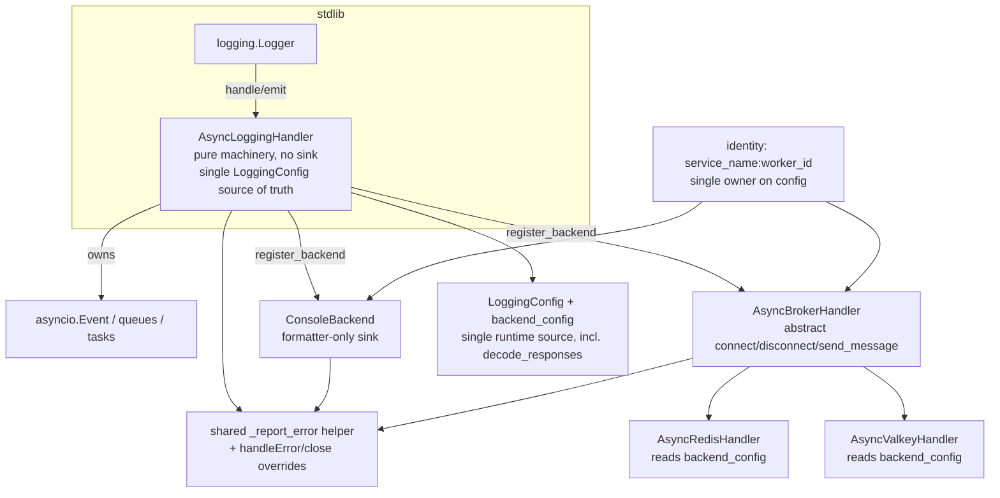

# Architecture Review

**Repository:** `scietex.logging` (v0.2.0)
**Date:** 2026-09-06
**Scope:** Post-resolution deep review of the settled code at commit `fc0cf08`
(on top of `d05e721` and `5461275`), 97 tests green. This review builds on the
AR-013..AR-036 cycle documented in `2026-09-05.md`; all of those findings are
resolved in the current code and are **not** re-reported here. This review
examines what genuinely remains after the fix cycle, plus issues introduced by
the fixes themselves.

**Method:** All nine source modules and the prior review were read in full;
stdlib `logging` behavior (3.12) was verified against CPython source;
`backend_config`/`decode_responses`/`_report_error`/`worker_name` usage was
confirmed by grep against `src/`.

---

## Executive Summary

The architecture is **sound** and is in materially better shape than at the end
of the prior cycle. The worker failure-handling cluster (AR-013/014/015/022/032),
the config single-source-of-truth decision (AR-016/023), the broker/formatter
decoupling (AR-018), and the drain-status redesign (AR-019) have all landed
coherently and are well-tested. There are **no CRITICAL and no HIGH** findings.

What remains falls into two buckets:

1. **The typed-config seam is only half-finished.** `LoggingConfig` is now the
   single source of truth for the *machinery* fields, but `backend_config`
   (`RedisConfig`/`ValkeyConfig`) is still a **write-only ornament**: `connect()`
   drives the real client from the raw `client_config` dict, never reading
   `self.config.backend_config`. Worse, `connect()` hardcodes
   `decode_responses=True` while `RedisConfig.decode_responses` defaults to
   `False`, so the typed projection can disagree with runtime behavior (AR-101).
2. **The stdlib `logging.Handler` lifecycle contract is not honored.** There is
   no `close()`/`flush()`/`handleError()` override, so `logging.shutdown()` at
   interpreter exit will not stop workers or close a broker client (AR-103), and
   the off-loop `emit()` guard raises `RuntimeError` into the caller's logging
   statement rather than routing through a handler-level error sink (AR-102).

The highest-value work is **small and non-structural**: document the
console-only formatter semantics (AR-104), decide the fate of the typed backend
config (AR-101 — either make `connect()` read it or delete it), and add an
explicit `close()`/`handleError()` story (AR-102/AR-103). The rest are LOW
trade-offs and preferences, several of which are already deliberate and merely
worth recording.

---

## Architecture Assessment

### Boundaries & responsibilities

The layer split is clean and was preserved through the fix cycle: stdlib
`logging` integration (`AsyncLoggingHandler.emit`) → async queue/event machinery
(no sink) → peer backends (`ConsoleBackend`, `AsyncBrokerHandler`) → concrete
transports (`AsyncRedisHandler`/`AsyncValkeyHandler`). The one boundary that
leaks is the **constructor surface**: `AsyncLoggingHandler.__init__` — the
"pure machinery" base — accepts `stdout_enable` (a console concern) and
`backend_config` (a broker concern) and merely forwards them to `LoggingConfig`
without acting on them (AR-116). This is a shallow "god parameter list" smell,
not a defect, but it means the base class is not as backend-agnostic as its
docstring claims.

### Dependencies

Still acyclic and strictly top-down (`config`/`formatter` are stdlib leaves;
`__init__.py` is the only guarded importer). The only type-level coupling worth
noting is that the machinery base imports `RedisConfig`/`ValkeyConfig` solely
for the `backend_config` type hint (AR-101/AR-116).

### Abstractions

`AsyncBrokerHandler`'s `connect`/`disconnect`/`send_message(dict[str,str])`
contract is well-formed and the Redis-vs-Valkey `xadd` argument difference is a
legitimate, documented adapter seam. The console-as-peer-backend abstraction is
genuinely good. The weakest abstraction is the broker handler's inheritance
from `AsyncBaseHandler`, which silently attaches console output to every broker
backend unless `stdout_enable=False` (AR-106).

### Lifecycle

Start/stop/restart is coherent and tested; `stop_logging` is idempotent and
drops undelivered records honestly. The two lifecycle gaps are (a) no
`close()`/`flush()` override for stdlib `shutdown()` (AR-103) and (b) `_loop`
captured at `start_logging` and never reset, so restart is loop-bound and the
"same loop only" rule is undocumented in code, only prose (AR-113).

### Concurrency

Single-loop, single-thread model; `emit` is serialized by the inherited stdlib
handler lock; workers are isolated per-queue. The only latent concurrency
hazard is the shared `LogRecord` fan-out, which is safe only because
`ScietexFormatter.format` copies the record — a non-copying user formatter
would leak mutations across backends (AR-111).

### State ownership

Queues, events, tasks, and the client are all instance attributes — no global
mutable state except the `_error_logger` module logger (duplicated in two
modules, AR-108). The one soft spot is that handler identity
(`service_name:worker_id`) is now computed in two places — the formatter and
the broker worker — so it can silently diverge (AR-107).

### Testability & extensibility

Good: worker factories, injectable `error_handler`, `FakeBrokerHandler`, and a
`register_backend` seam make the machinery testable without live servers. The
extension-point edge cases are: a backend registered without a `drain` hook is
silently dropped at stop (AR-110), and a broker subclass naming its queue
`"console"` collides with the console backend (AR-109).

---

## Strengths (genuine, to preserve)

1. **Coherent worker failure handling.** Ack-in-`finally`, client teardown on
   send failure, bounded backoff, and `disconnect`-in-`finally` now form one
   consistent, tested cluster (AR-013/014/015/022/032).
2. **Single source of truth for machinery config.** Handlers read
   `self.config.*` at work time; the flat attributes are read-only aliases
   (`async_logging_handler.py:188-198`).
3. **Broker wire format decoupled from the formatter.** Payload derives from
   config + record, invariant under `setFormatter` (`message_broker_handler.py:192-199`).
4. **Coordinator-owned drain reporting.** Hooks return `BackendDrainResult`;
   the console is an explicit post-drain observer, not an order-dependent
   list reader (`async_logging_handler.py:358-362`).
5. **Honest overflow and drop policy.** Bounded queues, drop-and-report on
   overflow, documented drop-on-stop semantics.
6. **Strict, acyclic, stdlib-only-leaf dependency graph.**

---

## Critical Issues

None.

## Major Issues

None. (No HIGH findings remain.)

## Moderate Issues

### AR-101 — Typed `backend_config` is still write-only; `decode_responses` is silently overridden
- **Severity:** MEDIUM
- **Evidence:** `redis_handler.py:85` (`backend_config=RedisConfig(**raw)`),
  `redis_handler.py:89` (`self.client_config: dict = raw`),
  `redis_handler.py:103` (`redis.Redis(**self.client_config, decode_responses=True)`);
  `valkey_handler.py:86-88,92,108-115`; `config.py:73`
  (`decode_responses: bool = False`). Grep confirms **no read** of
  `.backend_config` anywhere in `src/` — it is only asserted by tests
  (`test_redis_handler.py:93-95`, `test_valkey_handler.py:101`).
- **Problem:** `connect()` builds the client from the raw `client_config` dict,
  never from `self.config.backend_config`. The typed projection survives the
  deletion test only as a test ornament. Additionally, `connect()` forces
  `decode_responses=True` regardless of the user-supplied value, so
  `redis_config={"decode_responses": False}` stores `False` in the typed config
  while the handler silently uses `True`. `ValkeyConfig` models only
  `addresses` while `RedisConfig` models 39 fields — the two backends' typed
  projections are asymmetric.
- **Why it matters:** a second, lossy representation that can disagree with
  runtime invites drift; a maintainer can "fix" `decode_responses` in the typed
  config and observe no effect.
- **Recommendation:** either make `connect()` read `self.config.backend_config`
  (and reconcile `decode_responses`), or delete the typed backend config and let
  the raw dict be the single representation. Do not keep both.
- **Confidence:** HIGH (grep-verified no reader).

### AR-102 — Off-loop `emit` raises `RuntimeError` into the calling thread; no `handleError` override
- **Severity:** MEDIUM
- **Evidence:** `async_logging_handler.py:298-306` (raises `RuntimeError` off
  loop). No `handleError` override exists (grep: no `def handleError` in
  `src/`). CPython 3.12 `logging`: `Handler.handle` wraps `emit` only in
  `try/finally` for lock release, **not** `try/except`; `Logger._log` does not
  wrap `self.handle(record)` either.
- **Problem:** the off-loop `RuntimeError` is not caught by the stdlib; it
  propagates out of `logger.info(...)` into the user's code, and the record is
  dropped. (The commonly assumed "stderr traceback via `handleError`" only
  happens for stdlib handlers that catch their own `emit` exceptions — this
  handler does not.) Logging from a worker thread or thread-pool executor,
  common in asyncio applications, therefore raises in the calling thread.
- **Why it matters:** a logging library's emit path should never raise into the
  application. The documented "off-loop unsupported" constraint has a sharp edge
  the documentation does not describe.
- **Recommendation:** catch the off-loop case in `emit` and route it through
  `handleError`/the error channel (drop-and-report) instead of raising, or
  override `handleError` so the error is visible via a configurable sink.
- **Confidence:** HIGH (source-verified against CPython 3.12 logging).

### AR-103 — No `close()`/`flush()`/`handleError()` override; stdlib `shutdown()` won't stop workers or close the client
- **Severity:** MEDIUM
- **Evidence:** grep for `def (close|flush|handleError)` in `src/` returns
  nothing. CPython 3.12 `logging.shutdown()` calls `h.flush()` then `h.close()`;
  the base `Handler.flush` is `pass`, and `Handler.close` only sets `_closed`
  and removes the handler from the name map.
- **Problem:** at interpreter exit (`logging.shutdown()`), running workers and an
  open broker client are abandoned — the async teardown contract
  (`await stop_logging()`) is never invoked, because `close()`/`flush()` are
  synchronous and no override bridges them.
- **Why it matters:** stdlib's teardown contract is silently unmet; an app that
  relies on `logging.shutdown()` leaks a client connection and drops queued
  records. This is partly inherent (sync `close()` cannot `await`), but it is
  unacknowledged.
- **Recommendation:** at minimum, override `close()` to mark the handler closed
  and document that graceful teardown requires `await stop_logging()`; consider
  a best-effort flag so a later `start_logging()` is refused once `close()` ran.
- **Confidence:** HIGH (grep-verified absence; stdlib source verified).

### AR-104 — Formatter affects console output only, not broker payloads — asymmetric and under-documented
- **Severity:** MEDIUM
- **Evidence:** `formatter=` kwarg is threaded through every handler
  (`async_logging_handler.py:124`, `redis_handler.py:47`, `valkey_handler.py:47`);
  the broker worker builds its dict from config + record and never reads the
  formatter (`message_broker_handler.py:192-199`). User-facing docs
  (`configuration.md:180-197` "Custom Formatters"; `advanced.md`) show
  `setFormatter`/formatter injection without stating it only affects stdout.
- **Problem:** a user injecting a custom formatter into `AsyncRedisHandler`
  (especially with `stdout_enable=False`) expects broker output to change; it
  does not — the formatter is effectively dead weight on a broker-only handler.
  This surprise is a direct consequence of the otherwise-correct AR-018/AR-024
  work and is documented only in `docs/architecture/components.md:236`, not in
  the user guides.
- **Why it matters:** a supported API (`formatter=`, `setFormatter`) has a
  misleading semantic on broker handlers, which is exactly the kind of silent
  surprise the AR-018 fix was meant to eliminate.
- **Recommendation:** document the console-only formatter semantics prominently
  in `configuration.md`/`advanced.md`; consider whether `formatter=` should be
  console-specific (i.e. only meaningful on `AsyncBaseHandler`) or whether a
  broker payload schema hook is wanted instead.
- **Confidence:** HIGH.

### AR-105 — Shutdown latency scales with backend count; slow on a broker outage
- **Severity:** MEDIUM
- **Evidence:** `async_logging_handler.py:358-360` drains `_drain_hooks`
  sequentially, each `await drain(timeout)`; then `:373-384` bounds the worker
  gather with the same `timeout`. During an outage the broker worker sleeps in
  backoff (`message_broker_handler.py:174-178`), so its `queue.join()` in `drain`
  (`message_broker_handler.py:245`) always times out.
- **Problem:** worst-case stop = `N_backends × timeout + timeout` (console +
  broker ≈ 15s at default 5s). A single down broker costs the full drain
  timeout plus the gather timeout before cancellation reaps the worker.
- **Why it matters:** graceful shutdown is the feature this class exists for;
  it is slowest precisely when a backend is unhealthy. The design is correct
  (bounded, eventually terminates) but the additive timeouts are not obvious.
- **Recommendation:** drain backends concurrently (gather the drain hooks under
  one shared timeout), or apply a single overall shutdown budget rather than a
  per-backend one.
- **Confidence:** HIGH.

## Minor Issues

### AR-106 — Broker handlers inherit console-by-default; confusing base-class naming
- **Severity:** LOW
- **Evidence:** `message_broker_handler.py:25` (`class AsyncBrokerHandler(AsyncBaseHandler, abc.ABC)`), `:57` (`stdout_enable: bool = True`); `basic_handler.py:16`.
- **Problem:** every broker backend is a console handler unless explicitly told
  `stdout_enable=False`; the broker abstraction is coupled to the console sink
  through inheritance rather than composition. Separately, `AsyncBaseHandler`
  is really "console handler" while `AsyncLoggingHandler` is the true base —
  the names invert expectation.
- **Why it matters:** a new broker backend author must remember a console
  opt-out; the naming misleads first-time readers.
- **Recommendation:** prefer composition (broker registers a console peer only
  when requested) or rename for clarity; at least document the default.
- **Confidence:** HIGH (design tension; deliberate convenience).

### AR-107 — Identity string computed in two places; diverges with a custom formatter
- **Severity:** LOW
- **Evidence:** `formatter.py:54` (`self.worker_name = f"{service_name}:{worker_id}"`) vs `message_broker_handler.py:193` (`name = f"{self.config.service_name}:{self.config.worker_id}"`).
- **Problem:** handler identity is derived independently by the formatter and the
  broker. Constructing `AsyncRedisHandler(service_name="A",
  formatter=ScietexFormatter(service_name="B"))` yields console "B" and broker "A".
- **Why it matters:** AR-018 removed the broker's dependence on the formatter but
  left identity duplicated rather than centralized; the two can drift silently.
- **Recommendation:** derive the formatter's worker_name from `config` (single
  owner) or expose identity as a first-class handler attribute both consume.
- **Confidence:** HIGH.

### AR-108 — `_report_error` and `_error_logger` duplicated across handler and console backend
- **Severity:** LOW
- **Evidence:** `async_logging_handler.py:397-425` and `console_backend.py:131-158`
  are near-identical; `_error_logger` is defined at `async_logging_handler.py:20`
  and again at `console_backend.py:17`.
- **Problem:** two ~28-line copies of the same error-routing policy will drift.
  `console_backend.py` already imports from `async_logging_handler`, so there is
  no cycle blocking a shared helper.
- **Why it matters:** maintenance burden; the "fall through to module logger on a
  raising error_handler" guarantee must be kept in lockstep in two places.
- **Recommendation:** extract one `_report_error(handler_name, error_handler,
  record, exc)` helper in a neutral leaf and call it from both.
- **Confidence:** HIGH.

### AR-109 — `queue_name="console"` collides with the console backend under default `stdout_enable`
- **Severity:** LOW
- **Evidence:** `basic_handler.py:88-89` registers `"console"`; then
  `message_broker_handler.py:99-104` registers `self.queue_name`; the duplicate
  guard raises `ValueError` (`async_logging_handler.py:231-232`).
- **Problem:** `AsyncBrokerHandler(queue_name="console")` with the default
  `stdout_enable=True` raises at construction; only `stdout_enable=False` avoids
  it. `"console"` is a plausible name for a custom broker subclass.
- **Why it matters:** the AR-028 duplicate guard turned a silent overwrite into a
  loud failure, but the reserved name isn't documented for the extension point.
- **Recommendation:** document `"console"` (and `"redis"`/`"valkey"`) as
  reserved, or namespace the console backend name.
- **Confidence:** HIGH.

### AR-110 — A backend registered without a `drain` hook is silently dropped at stop
- **Severity:** LOW
- **Evidence:** `register_backend` only appends `drain` when not `None`
  (`async_logging_handler.py:235-236`); `stop_logging` drains only `_drain_hooks`
  (`:358-360`) then drops leftover records (`:392-395`).
- **Problem:** a custom backend registered with no `drain` hook never gets a
  `queue.join()`; its queued records are dropped at teardown with no attempt to
  flush and no status result.
- **Why it matters:** the `drain` parameter is documented as optional, but the
  consequence (no graceful drain) is not; a naive custom backend loses records
  at every stop.
- **Recommendation:** require a `drain` hook, or default to a generic
  `queue.join()` drain when none is supplied.
- **Confidence:** MEDIUM (behavioral, not just cosmetic).

### AR-111 — Shared `LogRecord` fan-out is safe only because the default formatter copies
- **Severity:** LOW
- **Evidence:** `async_logging_handler.py:309-311` fans one record into every
  queue; `ScietexFormatter.format` copies (`formatter.py:87`). A user formatter
  that mutates `record` in place (a common pattern, cf.
  `advanced.md:145-150`'s own example) leaks changes to the broker worker and
  vice versa.
- **Why it matters:** latent, not current — the shipped formatter is safe, but
  the safety is an implicit convention, not an enforced contract.
- **Recommendation:** document that formatters must not mutate the record (or
  copy it), or hand each backend a defensive copy at emit time.
- **Confidence:** HIGH.

### AR-112 — Synchronous `error_handler` inside `emit` can stall the hot path
- **Severity:** LOW
- **Evidence:** `async_logging_handler.py:316,318` calls `self._report_error`
  synchronously on overflow; `:411-414` invokes `config.error_handler` directly.
- **Problem:** a slow or blocking user `error_handler` runs on the producer's
  thread inside `emit`, stalling the logging call under exactly the overload
  condition that triggers the callback.
- **Why it matters:** the drop path, meant to keep the producer non-blocking, can
  itself block on user code. Only the error path is affected, hence LOW.
- **Recommendation:** document the callback's fast/sync expectation, or defer
  error reporting to a worker/queue.
- **Confidence:** HIGH.

### AR-113 — `_loop` captured at start, never reset on stop; cross-loop restart unsupported
- **Severity:** LOW
- **Evidence:** `async_logging_handler.py:271` sets `self._loop`; `stop_logging`
  (`:320-395`) never resets it to `None`; `emit` compares against it (`:302`).
- **Problem:** restart on a different loop is unsupported (documented in prose
  only). `_loop` is reassigned on the next `start_logging`, so the practical
  risk is low, but the invariant is not enforced or encoded.
- **Why it matters:** a host app moving a handler between loops gets either a
  confusing off-loop error or loop-bound queues, with no clear message.
- **Recommendation:** reset `_loop = None` on stop, and/or assert loop identity
  in `start_logging` for a clear error.
- **Confidence:** HIGH (documented constraint; LOW impact).

### AR-114 — `config.py` is a mixed-responsibility leaf (accepted, but a dumping ground)
- **Severity:** LOW
- **Evidence:** `config.py:1-8,114-147` hosts dataclasses plus
  `validate_queue_maxsize`, `level_abbreviation`, and `optional_dependency_error`.
- **Problem:** three non-config concerns live in the config module purely because
  it is the stdlib-only leaf (the AR-026/AR-036 resolutions chose this). It is
  defensible, but it is not single-responsibility.
- **Why it matters:** every future cross-module helper will be drawn here,
  widening the leaf's interface.
- **Recommendation:** acceptable as-is; if a neutral leaf for helpers is ever
  warranted, split helpers from dataclasses. (Recorded, not actioned.)
- **Confidence:** HIGH (already resolved-as-designed; residual note).

### AR-115 — `AsyncBaseHandler` reaches into `ConsoleBackend._worker` (private)
- **Severity:** LOW
- **Evidence:** `basic_handler.py:91` passes `self._console_backend._worker` to
  `register_backend`.
- **Problem:** a private attribute is a registration seam. It works but signals a
  missing public accessor.
- **Why it matters:** cosmetic within-package; would only matter if
  `ConsoleBackend._worker` were renamed/refactored.
- **Recommendation:** expose a public `worker`/`worker_factory` property on
  `ConsoleBackend`.
- **Confidence:** HIGH.

### AR-116 — `AsyncLoggingHandler.__init__` funnels subclass concerns (`stdout_enable`, `backend_config`, `formatter`)
- **Severity:** LOW
- **Evidence:** `async_logging_handler.py:122-124` accepts `stdout_enable`,
  `backend_config`, `formatter` and "stores them on `config` without acting on
  them" (`:130-132`).
- **Problem:** the "pure machinery, no sink" base carries console- and
  broker-specific constructor parameters, eroding its backend-agnostic claim and
  making every subclass re-declare the full parameter list (five handlers each
  repeat the signature).
- **Why it matters:** the parameter list is high-leverage and duplicated across
  five constructors; adding an option means touching all of them.
- **Recommendation:** consider a single `LoggingConfig`-accepting constructor
  (or narrower per-layer constructors) so options flow as data, not repeated
  kwargs.
- **Confidence:** HIGH (design smell; LOW impact).

---

## Cross-Cutting Analysis

1. **The typed-config seam is the one genuinely unfinished thread.** AR-016/023
   made `LoggingConfig` the source of truth for machinery fields, but
   `backend_config` remained write-only and `connect()` kept the raw dict
   (AR-101), which also drives the `decode_responses` contradiction. The config
   story is still "two representations, one read." This is the clearest
   follow-on to the P2 work.

2. **The stdlib `logging.Handler` contract is only partially honored.** `emit`/
   `start`/`stop` are the async contract; `close`/`flush`/`handleError` are
   absent (AR-102/AR-103). The package defines a clean async lifecycle but
   leaves the sync teardown contract and the error-handling contract of stdlib
   unaddressed. These two are the sharpest edges for real-world embedding.

3. **Identity and formatter semantics drifted apart.** AR-018 correctly decoupled
   the broker payload from the formatter, but left identity computed in two
   places (AR-107) and the formatter's scope (console-only) implicit (AR-104).
   The "formatter renders, config is identity" principle is half-applied: it
   holds for the broker, not for the console formatter's `worker_name`.

4. **Duplication is now the dominant maintainability cost, not bugs.** The P1/P3
   fixes introduced parallel structures that are correct but repeated:
   `_report_error`/`_error_logger` (AR-108), the constructor signature across
   five handlers (AR-116), the identity string (AR-107). None is wrong; each
   adds drift surface.

5. **Refuted/benign candidates.** The `formatter_provider` mid-run consistency
   concern (candidate 16) is a non-issue: everything runs on one loop thread, so
   the provider read has no race; a formatter swap affects only records
   formatted after the swap, which is the documented intent. The shared-record
   mutation risk (AR-111) is real only for a *user* formatter, not the shipped
   one.

---

## Architectural Recommendations

### Priority 1 (fix first — small, high-clarity)

1. **AR-101** — decide the typed backend config: make `connect()` read
   `self.config.backend_config` (reconciling `decode_responses`), or delete the
   typed `RedisConfig`/`ValkeyConfig` and keep the raw dict. Resolve before
   anything else, since it dictates the public config surface.
2. **AR-104** — document the console-only formatter semantics in
   `configuration.md`/`advanced.md` (one paragraph), and state it in the broker
   handlers' `formatter=` docstrings.

### Priority 2 (important — lifecycle contract)

3. **AR-102** — route the off-loop case through `handleError`/error channel
   (drop-and-report) instead of raising into the caller.
4. **AR-103** — add a `close()` override that marks the handler closed and
   documents that async teardown requires `await stop_logging()`.
5. **AR-105** — bound total shutdown with one shared timeout (concurrent drains).

### Priority 3 (opportunistic — hardening/clarity)

6. **AR-107** — centralize identity so formatter and broker share one source.
7. **AR-108** — extract a shared `_report_error` helper.
8. **AR-109/AR-110** — document reserved backend names; require/default a drain
   hook so a drain-less backend cannot silently lose records.
9. **AR-106/AR-115/AR-116** — naming/encapsulation/constructor-surface cleanup.
10. **AR-111/AR-112/AR-113/AR-114** — record as accepted conventions or
    document the constraints; no code change strictly required.

---

## Suggested Target Architecture

The current architecture is already close to target; the recommendations are
refinements, not a redesign.

Target properties:

- **Config is read, not written-only.** `connect()` consumes
  `self.config.backend_config` (or the typed layer is deleted); `decode_responses`
  is not silently forced.
- **Identity has one owner.** `service_name:worker_id` lives on `config`; both the
  formatter and the broker derive from it.
- **The stdlib contract is honored.** `emit` never raises into the caller
  (off-loop → drop-and-report via `handleError`/error channel); `close()` marks
  the handler closed; graceful async teardown remains `await stop_logging()`.
- **One error reporter.** A single `_report_error` serves the handler and the
  console backend.
- **Shutdown has one budget.** Concurrent drains under a single timeout, so a
  down backend does not multiply the stop latency.

---

## Migration Strategy

Incremental, each step independently verifiable (`uv run pytest -q`,
`uv run ruff check .`, `uv run ty check src/scietex/logging/`):

1. **AR-104** first (docs-only, no risk) — clarify formatter scope.
2. **AR-101** as a focused config refactor with its own test pass; update
   `test_redis_handler.py`/`test_valkey_handler.py` which currently assert the
   write-only projection.
3. **AR-102 + AR-103** together (both touch the stdlib lifecycle boundary); add
   an off-loop emit test and a `close()` test.
4. **AR-105** (concurrent drains) with a multi-backend shutdown-timing test.
5. **AR-107/AR-108** (identity centralization + shared error helper) as a
   small refactor; the shared helper must land before AR-106/AR-115 cleanup so
   the error policy stays single-sourced.
6. Remaining LOW items (AR-109/AR-110/AR-111/AR-112/AR-113/AR-114/AR-116) as
   opportunistic hardening, each optional and non-breaking.

Ordering rationale: the config decision (AR-101) is the only one that changes
the public surface, so it should be decided before the docs are frozen (AR-104);
the error/lifecycle items (AR-102/AR-103/AR-108) share the same policy and are
cheapest to land together.

---

## Open Questions

1. **Backend config fate:** keep the typed `RedisConfig`/`ValkeyConfig` and make
   `connect()` read them, or delete them and let the raw dict be authoritative?
   Drives AR-101 and the public API.
2. **`decode_responses`:** should it always be `True` (handlers deal in strings)
   and be removed from the modeled surface, or be respected if a user sets it?
3. **Formatter scope:** is `formatter=`/`setFormatter` intended to be
   console-only (and so should move off the broker constructors), or should a
   broker payload-schema hook be added? Drives AR-104/AR-107.
4. **Off-loop policy:** drop-and-report (align with overflow) vs raise (loud
   failure)? The current raise may be intentional; AR-102 proposes the
   alternative.
5. **`close()` semantics:** can `close()` do anything beyond a flag, given async
   teardown cannot be awaited synchronously? Is `close()`-then-restart supposed
   to be refused?
6. **Reserved backend names:** should `"console"` be namespaced (e.g.
   `"_console"`) so user `queue_name` values can never collide (AR-109)?

---

## Final Prioritization

| ID | Issue | Severity | Impact | Effort | Priority |
|----|-------|----------|--------|--------|----------|
| AR-101 | Typed `backend_config` write-only; `decode_responses` overridden | MEDIUM | Medium | Medium (1-2d) | P1 |
| AR-102 | Off-loop `emit` raises into caller; no `handleError` | MEDIUM | Medium | Short (1-4h) | P2 |
| AR-103 | No `close()`/`flush()`/`handleError()` override | MEDIUM | Medium | Short (1-4h) | P2 |
| AR-104 | Formatter console-only, under-documented | MEDIUM | Low | Quick (<1h) | P1 |
| AR-105 | Shutdown latency scales with backend count | MEDIUM | Medium | Short (1-4h) | P2 |
| AR-106 | Broker inherits console-by-default; naming | LOW | Low | Short (1-4h) | P3 |
| AR-107 | Identity string computed twice | LOW | Low | Quick (<1h) | P3 |
| AR-108 | `_report_error`/`_error_logger` duplicated | LOW | Low | Quick (<1h) | P3 |
| AR-109 | `queue_name="console"` collision | LOW | Low | Quick (<1h) | P3 |
| AR-110 | Drain-less backend silently dropped at stop | LOW | Low | Quick (<1h) | P3 |
| AR-111 | Shared-record mutation leak (custom formatter) | LOW | Low | Quick (<1h) | P3 |
| AR-112 | Sync `error_handler` stalls hot path | LOW | Low | Quick (<1h) | P3 |
| AR-113 | `_loop` never reset; cross-loop restart | LOW | Low | Quick (<1h) | P3 |
| AR-114 | `config.py` mixed responsibilities | LOW | Low | — (accepted) | P3 |
| AR-115 | `ConsoleBackend._worker` private access | LOW | Low | Quick (<1h) | P3 |
| AR-116 | Base constructor funnels subclass concerns | LOW | Low | Medium (1-2d) | P3 |
