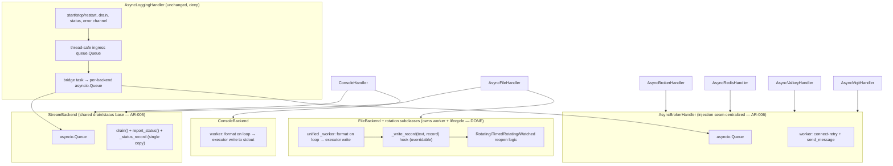

# Architectural Review — scietex.logging v2.0.0

**Date:** 2026-09-08
**Scope:** Full-repository deep architectural review of `scietex.logging` v2.0.0 (HEAD `60e96dd`, clean tree).
**Method:** Read `docs/architecture/*.md` as an initial map (not authoritative truth), then verified every claim against source. All 13 source modules under `src/scietex/logging/` read in full. Findings cite `file:line` evidence.
**Reviewer:** OpenCode orchestrator (deep architectural review task).

> **UPDATE (2026-09-08, post-review):** After this review was written, the file-backend refactor was implemented (see "Refactor Follow-Up" below). It **resolved AR-001, AR-002, and AR-003** (the file-backend worker findings). A subsequent change **resolved AR-004** (`backend_config` moved out of the machinery base; see its resolution note). Another change **resolved AR-005** (the duplicated drain/status-reporting machinery extracted into a shared `_QueueBackend` base; see its resolution note). A further change **resolved AR-006** (the duplicated broker client-injection config-handling consolidated into `AsyncBrokerHandler`; see its resolution note). A subsequent change **resolved AR-007** (the duplicated ISO-8601 UTC timestamp derivation single-sourced into `config.iso_timestamp`; see its resolution note). A further change **resolved AR-008** (the synthetic status-record naming decoupled from the queue-name constants via an optional `display_name` field; see its resolution note). Sections below are annotated with **[RESOLVED]** / **[OPEN]** status. The original findings are preserved for the record; resolved ones are marked and their resolution described.

---

## Executive Summary

`scietex.logging` v2.0.0 is a well-architected, asyncio-native, non-blocking logging library. The 2.0.0 breaking refactor (commit `b28c536`) delivered a genuinely cleaner design than the v0.2.0 architecture reviewed on 2026-09-06: the identity-parameter sprawl (`service_name`/`worker_id`/`instance_id`/`worker_name`/`resolve_instance_id`), the `stdout_enable` auto-console-sink coupling, and the formatter-on-broker-handlers coupling are all gone. Identity now flows solely from the standard-library logger name (`record.name`), and the console sink is an explicit peer backend.

The core producer/consumer machinery (`AsyncLoggingHandler`) is deep, correct, and restartable. The thread-safe ingress + bridge-task design (1.7.0) makes `emit()` safe from any thread with no running loop — a genuinely hard problem solved well. The single-thread write executor guarantees no write-after-close on teardown. The error channel is single-sourced through `config.report_error`. The dependency graph is strictly acyclic and top-down.

**No CRITICAL issues were found.** The architecture is sound and the machinery is correct. The findings that existed were **structural duplication and dead code** concentrated in the file/console backend layer — the result of the 2.0.0 refactor leaving two parallel worker-ownership models (console owns its worker; file does not) and a near-verbatim backend clone. These were maintainability problems (change amplification, misleading public surface), not correctness defects.

**Headline findings (status as of the post-review refactor):**
- **AR-001 (HIGH) — [RESOLVED]:** `FileBackend._worker` + `_write_stream` + `worker` property were **dead code** — `AsyncFileHandler` registered its own worker, never the backend's. Resolved by making `FileBackend` own its worker.
- **AR-002 (HIGH) — [RESOLVED]:** `backend/file.py` was a near-verbatim clone of `backend/console.py`. Resolved by giving `FileBackend` its own distinct lifecycle + rotation subclasses.
- **AR-003 (HIGH) — [RESOLVED]:** Four near-identical `_worker` methods in `handler/file.py` (base + 3 rotation variants). Resolved by collapsing into one unified `FileBackend._worker`.
- **AR-004 (MEDIUM) — [RESOLVED]:** `backend_config` is a write-only pass-through field on the machinery base.
- **AR-005 (MEDIUM) — [RESOLVED]:** Duplicated drain/status-reporting machinery across both peer backends.
- **AR-006 (MEDIUM) — [RESOLVED]:** Broker backends duplicate the client-injection config-handling pattern.
- **AR-007 (LOW) — [RESOLVED]:** Two independent record→dict wire derivations (broker payload vs `JsonFormatter`).
- **AR-008 (LOW) — [RESOLVED]:** Synthetic status-record naming couples to display strings.

---

## Architecture Assessment

### What the code does well

The architecture is built around a clean, layered producer/consumer pipeline:

```
host logger
   │  emit(record)  [sync, thread-safe, non-blocking]
   ▼
AsyncLoggingHandler ── thread-safe queue.Queue ingress (bounded, queue_maxsize=10000)
   │  bridge task fans out to per-backend asyncio.Queue
   ▼
per-backend worker coroutine ── format on loop thread ── blocking write/flush on _WriteExecutor
   ▼
sink (console / file / redis / valkey / mqtt)
```

**Verified strengths:**

1. **Deep machinery base.** `AsyncLoggingHandler` (556 lines) hides a large amount of lifecycle complexity (start/stop/restart, drain, status reporting, error routing, thread-safe emit) behind a small registration interface (`register_backend`, `register_status_reporter`). This is a textbook **deep module** — the interface is far smaller than the implementation it hides.

2. **Restartable lifecycle.** Worker factories are zero-arg callables registered in `__init__` and re-invoked by each `start_logging`. `stop_logging(timeout=5.0)` drains every backend concurrently under one shared timeout, collects `BackendDrainResult`s in registration order, invokes status reporters, and cancels stragglers. `close()` is a separate terminal op. This is a genuinely hard correctness property (restart on the same loop, no leaked tasks, no write-after-close) and it is implemented correctly.

3. **Thread-safe, loop-independent `emit()`.** The thread-safe ingress `queue.Queue` + bridge task (1.7.0) means `emit()` works from any thread, including one with no running asyncio loop. Off-loop emit delivers instead of dropping. This is the hardest problem in async logging and it is solved well.

4. **No write-after-close guarantee.** The file-owning worker submits its stream close to the *same* single-thread `_WriteExecutor` that serialized the writes, then `shutdown(wait=True)`. The executor is worker-local, so handlers stay restartable. Correct and elegant.

5. **Single-sourced error channel.** `config.report_error` (AR-108) centralizes error routing: invoke the user `error_handler` if set, else fall through to the module logger. Every worker and the bridge route through it. No scattered error handling.

6. **Clean client-injection seam.** Broker handlers accept an injected `client=` and never close it (caller owns lifetime/recovery via `_owns_client`/`_injected_client`). File handlers do the same for `file=`. `client` and `backend_config` are mutually exclusive (raises `ValueError`). This is a real, consistent **seam** for test doubles and externally-managed connections.

7. **Strictly acyclic dependency graph.** `config.py` is the stdlib-only leaf; everything depends downward. No cycles. High **locality** — related machinery lives together.

8. **Guarded optional imports.** `__init__.py` guards the three broker backends with `try/except ImportError` that re-raise unless `exc.name` matches the specific missing module. Clean optional-dependency handling.

### Cross-cutting concerns

**Worker-ownership model (now uniform).** The single most important structural theme of the original review was the console-vs-file worker-ownership asymmetry (AR-001/AR-002/AR-003): `ConsoleHandler` registered `backend.worker` (backend owns worker) while `AsyncFileHandler` registered its own `self._worker` (handler owns worker), leaving `FileBackend`'s worker dead. **This has been resolved by the post-review refactor.** `FileBackend` now owns its queue, worker, drain, status reporter, and the entire file lifecycle (lazy open / rollover / close-in-finally), and the four duplicated handler workers were collapsed into one unified `FileBackend._worker` gated by a `_needs_record_copy` class attribute. Both peer backends now honor the same contract: the backend owns its worker, and the handler is a thin constructor wrapper registering `backend.queue`/`backend.worker`/`backend.drain` — exactly mirroring `ConsoleHandler` → `ConsoleBackend`.

**Backend abstraction depth.** `ConsoleBackend`/`FileBackend` are shallow wrappers over (queue + worker + drain + status reporter). Their real value is the queue + status machinery; the worker is where backend-specific lifecycle lives. The file refactor made the file backend's worker earn its place (it now owns the real file lifecycle + rotation). The residual shallowness was the still-duplicated drain/status/`_status_record` machinery across the two backends (AR-005); that shared base (`_QueueBackend`) now exists, removing the last copy.

**Two wire-format derivations.** The broker worker (`handler/broker.py:225-232`) builds `{level, message, name, time}` directly from the record, and `JsonFormatter` (`formatter/json.py`) builds a different dict `{timestamp, level, logger, message, ...}`. Both derive from the record independently. This is intentional (the broker comment at `broker.py:219-224` explains why it must not depend on formatter internals) but it means the field-selection logic exists twice and can drift.

---

## Strengths

| # | Strength | Evidence |
|---|----------|----------|
| S1 | Deep, correct, restartable machinery base | `async_logging_handler.py` (556 lines) |
| S2 | Thread-safe, loop-independent `emit()` via ingress + bridge | `async_logging_handler.py` (1.7.0) |
| S3 | No write-after-close on teardown (same-executor close) | `handler/file.py:220-226`, `_executor.py` |
| S4 | Single-sourced error channel | `config.py` `report_error` (AR-108) |
| S5 | Clean, consistent client/file injection seam | `handler/broker.py:95-99`, `handler/file.py:114-116` |
| S6 | Strictly acyclic, top-down dependency graph | all modules |
| S7 | Guarded optional imports (re-raise unless specific module) | `__init__.py` |
| S8 | 2.0.0 refactor removed identity sprawl + console-sink coupling | `b28c536` |
| S9 | Overflow policy is drop + report, never crash | `async_logging_handler.py` |
| S10 | Connect retry with capped exponential backoff + jitter | `handler/broker.py:198-214` |

---

## Issues

### Critical

None found.

### Major (HIGH)

#### AR-001 — `FileBackend._worker` is dead code (HIGH, Confidence HIGH) — **[RESOLVED]**

**Evidence:** `handler/file.py:124-133` registers the handler's *own* `self._worker` and `self.drain`, explicitly not the `FileBackend`'s. The comment at `handler/file.py:124-127` states the worker must own the file lifecycle. `FileBackend._worker` (`backend/file.py:123-163`, a full ~40-line drain loop creating a `_WriteExecutor`, formatting via `formatter_provider`, executor-writing via `_write_stream`) and `_write_stream` and the `worker` property (`backend/file.py:113-121`) are therefore **never invoked** for the file path. Contrast: `ConsoleHandler` (`handler/console.py:66-71`) registers `self._console_backend.worker`, so `ConsoleBackend._worker` *is* live.

**Problem:** ~40 lines of dead code plus a misleading public `worker` accessor on `FileBackend`. A reader (or custom integrator) following the documented `worker` property pattern will register a worker that never opens the file and silently drops all records — the file is only ever opened by the handler's own worker.

**Why it matters:** Dead code is a correctness trap (the misleading accessor invites misuse) and a maintenance burden. The `worker` property docstring (`backend/file.py:115-120`) explicitly advertises it for registration, which is false for the file path.

**Recommendation:** Delete `FileBackend._worker`, `_write_stream`, and the `worker` property. The deletion test passes cleanly — the handler owns the file lifecycle and the backend's remaining responsibility (queue + status reporter) is unaffected. If a public worker accessor is genuinely needed for custom integrators, it must be the handler's worker, not the backend's. Alternatively, unify the model so the backend owns its worker in both cases (see AR-003).

**Confidence:** HIGH — directly verified in source; the registration at `handler/file.py:128-133` provably bypasses `FileBackend._worker`.

**Resolution:** The post-review refactor took the *alternative* recommendation (unify so the backend owns its worker). `FileBackend` now owns the file lifecycle and its `worker` property (`backend/file.py:168`) returns the live `_worker` (`backend/file.py:228`), which `AsyncFileHandler` registers (`handler/file.py:112-118`). The dead worker path is gone; the accessor is now truthful.

#### AR-002 — `backend/file.py` is a near-verbatim clone of `backend/console.py` (HIGH, Confidence HIGH) — **[RESOLVED]**

**Evidence:** `_status_record` is byte-identical in both (`backend/file.py:20-48` vs `backend/console.py:21-49`): same `display=result.name.lstrip('_')`, same INFO/ERROR level logic, same message strings, same `LogRecord` construction. `drain()` methods are identical except the queue-name constant (`_QUEUE_FILE` vs `_QUEUE_CONSOLE`). `report_status()` is identical. `_worker()` loops are identical except the write target (`_write_stream` via `stream_provider` vs `_write_stdout`).

**Problem:** Duplicated responsibility across two peer backends. Any change to the drain/status/worker skeleton must be made twice and can drift (as it already has — see AR-001, where the file copy is dead while the console copy is live).

**Why it matters:** Change amplification. The two backends are supposed to be peers with the same contract, but the file copy has silently diverged into dead code. A shared base (or a single parameterized backend) would keep them in lockstep.

**Recommendation:** Extract the shared drain/status/worker skeleton into a common base (e.g. a `_StreamBackend` or a shared mixin) parameterized by the write target and queue-name constant. This also resolves AR-001 and AR-004's duplication. Note the file path's worker must remain overridable to express the file lifecycle (see AR-003).

**Confidence:** HIGH — direct byte-level comparison of both files.

**Resolution:** The post-review refactor eliminated the worker-clone portion of this finding. `FileBackend` (`backend/file.py:64`) is no longer a clone of `ConsoleBackend` — it owns a distinct file lifecycle (`_open_stream`/`_close_stream`/`_write_record`) plus three rotation subclasses (`RotatingFileBackend`/`TimedRotatingFileBackend`/`WatchedFileBackend`), none of which exist in `ConsoleBackend`. The residual duplication is limited to the drain/status/`_status_record` machinery, which is tracked separately as AR-005.

#### AR-003 — Four near-identical `_worker` methods in `handler/file.py` (HIGH, Confidence HIGH) — **[RESOLVED]**

**Evidence:** `AsyncFileHandler._worker` (`handler/file.py:184-226`), `AsyncRotatingFileHandler._worker` (`handler/file.py:343-...`), `AsyncTimedRotatingFileHandler._worker` (`handler/file.py:482-...`), and `AsyncWatchedFileHandler._worker` (`handler/file.py:594-...`) are ~40-line loops that differ only in (a) whether a `copy.copy(record)` is made on the loop thread and (b) which `_write_record` override is dispatched. The executor creation, the `while running_event or not queue.empty()` loop, the `wait_for(get, 1)` with `TimeoutError: continue`, the `_report_error` on exception, the `task_done()` in `finally`, and the `executor.run(_close_stream)` + `executor.shutdown()` teardown are structurally identical across all four.

**Problem:** The file worker loop is copy-pasted four times. The rotation variants differ from the base only in the record-copy + `_write_record` dispatch, which is exactly the seam a single parameterized worker should express.

**Why it matters:** Change amplification and drift risk. A fix to the drain loop (e.g. the timeout handling or teardown ordering) must be applied four times. The record-copy requirement (rotation variants must not mutate the shared record off-loop) is a subtle invariant that is easy to break in one copy.

**Recommendation:** Collapse the four workers into one worker on `AsyncFileHandler` that dispatches through a single overridable `_write_record(text, record)` hook, with the record-copy decision driven by a flag or by whether the subclass needs the record. The rotation variants already override `_write_record`; only the worker loop needs unifying. This also lets the file backend own a single worker (resolving AR-001 cleanly).

**Confidence:** HIGH — direct structural comparison of all four methods.

**Resolution:** The post-review refactor collapsed the four handler workers into one unified `FileBackend._worker` (`backend/file.py:228`), which dispatches through the overridable `_write_record(text, record)` hook. The record-copy decision is driven by the `_needs_record_copy` class attribute (`backend/file.py:105`; `True` on `RotatingFileBackend`/`TimedRotatingFileBackend`, `False` on base/`WatchedFileBackend`). The rotation variants are now backend subclasses overriding only `_write_record`. The four handlers are thin wrappers with no `_worker` of their own.

### Moderate (MEDIUM)

#### AR-004 — `backend_config` is a write-only pass-through field on the machinery base (MEDIUM, Confidence HIGH) — **[RESOLVED]**

**Evidence:** `AsyncLoggingHandler.__init__` accepts `backend_config` (`async_logging_handler.py:145`) and forwards it into `LoggingConfig` (`async_logging_handler.py:173`). The base machinery never reads it — only broker subclasses read `self.config.backend_config` (`handler/redis.py:98`, `handler/valkey.py:98`, `handler/mqtt.py:111`). The base docstring even admits this (`async_logging_handler.py:151`: "``backend_config`` is forwarded by the broker subclasses; the base ...").

**Problem:** A write-only field on the shared base. `LoggingConfig` is the shared machinery config, but `backend_config` is only meaningful to broker handlers. This echoes the resolved AR-116/AR-101 god-parameter pattern — a base carrying a field only a subclass consumes.

**Why it matters:** Interface clarity. A reader of `LoggingConfig` sees `backend_config` and assumes the machinery uses it. It is a shallow, misleading field on a high-leverage shared type.

**Recommendation:** Move `backend_config` out of `LoggingConfig`/the base constructor and into the broker handler constructors (which already accept it and are the only consumers). The base should not carry broker-specific config. If kept for API stability, document it as broker-only and type it as such.

**Confidence:** HIGH — grep confirms the base never reads `backend_config`; only the three broker handlers do.

**Resolution:** The recommendation was implemented. `backend_config` was removed from `LoggingConfig` and from `AsyncLoggingHandler.__init__`; `AsyncBrokerHandler` now stores it as its own typed `self.backend_config` attribute (broker-owned, not forwarded to the base). The three concrete broker handlers read `self.backend_config` in `client_config` and `connect()`. `client_config` now returns `{}` when `backend_config` is `None` (the injected-client case), fixing a latent `dataclasses.asdict(None)` `TypeError`, and `connect()` raises `RuntimeError` defensively if called with no `backend_config`. `ConsoleHandler(backend_config=...)` now raises `TypeError`. Version remains 2.0.0 (not yet released).

#### AR-005 — Duplicated drain/status-reporting machinery across peer backends (MEDIUM, Confidence HIGH) — **[RESOLVED]**

**Evidence:** `ConsoleBackend` and `FileBackend` each implement `drain()` (identical except queue-name constant), `report_status()`, and the module-level `_status_record()` (byte-identical). `AsyncLoggingHandler.register_backend` already provides a default drain (`queue.join()` wrapper returning `BackendDrainResult`), yet both backends re-implement it. The post-drain status-observer pattern (`report_status` putting synthetic `LogRecord`s) is duplicated across both backends.

**Problem:** The drain/status machinery is a shared concern that lives in two copies. The default drain in `register_backend` is bypassed by both backends in favor of identical custom implementations.

**Why it matters:** Change amplification (see AR-002). The status-observer pattern is a real cross-cutting concern that deserves a single home.

**Recommendation:** Fold the drain/status machinery into the shared backend base proposed in AR-002, or into `AsyncLoggingHandler` itself so both backends inherit it. The `_status_record` synthetic-record construction should live in one place.

**Confidence:** HIGH — direct comparison of both backend files.

**Resolution:** The recommendation was implemented as a new internal base module. `src/scietex/logging/backend/_base.py` now hosts `_QueueBackend` — a shared base holding the bounded queue, the `worker` property, `drain()`, `report_status()`, `_report_error()`, and the module-level `_status_record()` helper (all copied verbatim, with the queue-name and backend-name constants parameterized as `_queue_name`/`_backend_name` class attributes). `ConsoleBackend` (`backend/console.py:20`) and `FileBackend` (`backend/file.py:33`) now subclass `_QueueBackend` and keep only their backend-specific `_worker`/`_write_*`/file-lifecycle logic. The concrete `_worker` coroutines stay backend-specific, so the worker-property test (`worker.__func__ is ConsoleBackend._worker`) still holds. Behavior is unchanged; `report_status` message strings and `drain` results (`name == "_console"`/`"_file"`) are preserved.

#### AR-006 — Broker backends duplicate the client-injection config-handling pattern (MEDIUM, Confidence HIGH) — **[RESOLVED]**

**Evidence:** `AsyncRedisHandler` (`handler/redis.py`), `AsyncValkeyHandler` (`handler/valkey.py`), and `AsyncMqttHandler` (`handler/mqtt.py`) each re-implement: (a) the `if client is not None: cfg=None else cfg=defaults` injection decision in `__init__`, (b) a `client_config` property (`dataclasses.asdict(cast(...))`), and (c) a `connect()` that does `cfg = asdict(...)` + `pop` reserved keys + filter `None` kwargs before constructing the client.

**Problem:** The client-injection seam (AR-005 of the prior review) is consistent in *behavior* but triplicated in *code*. Each backend re-derives the same "injected client vs config" decision and the same asdict/pop/filter dance.

**Why it matters:** Change amplification. A change to the injection contract (e.g. how `client` and `backend_config` interact) must be made in three places. The `connect()` config-translation is backend-specific (each pops different keys), but the injection decision and `client_config` shape are shared.

**Recommendation:** Move the injection decision (`client` vs `backend_config` mutual exclusion, `_owns_client`/`_injected_client`) fully into `AsyncBrokerHandler` (it already owns the seam at `handler/broker.py:95-99`), and provide a shared helper for the asdict/pop/filter pattern. Each backend keeps only its genuinely backend-specific client construction.

**Confidence:** HIGH — direct comparison of the three broker handlers.

**Resolution:** The recommendation was implemented with a deliberate scope limit. The genuinely-duplicated machinery was consolidated into `AsyncBrokerHandler`: the byte-identical `client_config` property now lives once on the base (`handler/broker.py`), and a new `_config_dict()` helper (`handler/broker.py`) centralizes the repeated connect()-guard + `dataclasses.asdict(self.backend_config)` block. Each concrete handler's `connect()` now delegates to `self._config_dict()`, which raises the same `RuntimeError` message as before (via `type(self).__name__`, so the hardcoded "AsyncRedisHandler"/"AsyncValkeyHandler"/"AsyncMqttHandler" strings are preserved). The `__init__` injection decision was intentionally **not** extracted — it is too small and too backend-coupled (each handler's config class and defaults differ), so a base helper would be a shallow abstraction; it remains in each handler. The asdict/pop/filter `connect()` body is genuinely backend-specific (each pops different reserved keys) and stays per-handler. `disconnect()`/`send_message()` None-guards and the mutual-exclusion `ValueError` check were left unchanged.

### Minor (LOW)

#### AR-007 — Two independent record→dict wire derivations (LOW, Confidence HIGH) — **[RESOLVED]**

**Evidence:** The broker worker builds `{level, message, name, time}` directly from the record (`handler/broker.py:225-232`), while `JsonFormatter` builds `{timestamp, level, logger, message, ...}` (`formatter/json.py`). Both derive from the record independently.

**Problem:** The field-selection logic (which record attributes become wire fields, how level/time are rendered) exists in two places and can drift.

**Why it matters:** The broker comment (`handler/broker.py:219-224`) correctly explains why the broker must not depend on formatter internals — a custom formatter must not silently change the wire format. So this is a deliberate trade-off, not a bug. But the shared field-selection logic (level abbreviation, ISO-8601 UTC time) could be factored into a single record→dict helper used by both, keeping the wire format stable while removing the duplication.

**Recommendation:** Extract a shared `record_to_dict(record)` (or similar) helper that both the broker worker and `JsonFormatter` use, so level/time/name rendering is single-sourced. Keep the broker's independence from *formatter* internals — the helper should be a record-level concern, not a formatter concern.

**Confidence:** HIGH — direct comparison of both derivations.

**Resolution:** The genuinely-extractable duplication — the ISO-8601 UTC timestamp derivation, which appeared in three places (`formatter/json.py`, `handler/broker.py`, `formatter/scietex.py`) — was single-sourced into a stdlib-only helper `config.iso_timestamp(created)` (mirroring the `level_abbreviation` pattern from AR-026). All three call sites now delegate to it. The two wire *formats* were recognized as genuinely different contracts and intentionally **not** merged: the broker payload (`{level, message, name, time}` with abbreviated level) and the JSON formatter output (`{timestamp, level, logger, message, ...}` with full level name) serve different sinks and must stay independent, preserving the broker's deliberate independence from formatter internals.

#### AR-008 — Synthetic status-record naming couples to display strings (LOW, Confidence MEDIUM) — **[RESOLVED]**

**Evidence:** `_status_record` (`backend/file.py:20-48`, `backend/console.py:21-49`) builds a synthetic `LogRecord` with `name=f"{display.capitalize()}Logger"` where `display=result.name.lstrip('_')`, and message text describing the drain outcome.

**Problem:** The synthetic record's logger name and message are derived from the queue-name constant via string manipulation (`lstrip('_')` + `capitalize()` + `"Logger"`). This couples the status-reporting output to the internal queue-name encoding.

**Why it matters:** Cosmetic coupling. If a queue name changes or a custom backend uses an unexpected name, the synthetic status record's identity becomes odd. Low impact — this is a display concern.

**Recommendation:** Pass an explicit display name to the status reporter rather than deriving it from the queue-name constant. Low priority.

**Confidence:** MEDIUM — the coupling is real but the impact is cosmetic.

**Resolution:** Option A was implemented. `BackendDrainResult` gained an optional `display_name: str | None = None` field (`async_logging_handler.py`), decoupling the shutdown-status record naming from the queue-key encoding. The built-in peer backends now pass a label through `_QueueBackend.drain` via a new `_display_name` property derived from `_backend_name` (e.g. "ConsoleBackend" → "Console"), while broker handlers and custom backends — which construct `BackendDrainResult` without a display name — keep the existing `_status_record` fallback (`result.name.lstrip("_")`). `_status_record` now prefers `result.display_name` and capitalizes consistently across all three branches, so the previously lowercased TIMEOUT/ERROR messages ("valkey logger"/"broker Logger") now render as "Valkey logger"/"Broker Logger".

---

## Cross-Cutting Analysis

**Worker-ownership model.** The single most important structural theme is the console-vs-file worker-ownership asymmetry (AR-001/AR-002/AR-003). Console backends own their workers; the file handler owns its worker and leaves the file backend's worker dead. The cleanest resolution is to make the file backend's worker the single owner of the file lifecycle (lazy open / rollover / close-in-finally) and collapse the four handler workers into one dispatch through `_write_record`. This would make both peer backends honor the same contract and eliminate three findings at once.

**Backend abstraction depth.** The `backend/` package is the shallowest layer. Its real value is the queue + status machinery; the worker is where backend-specific lifecycle lives. Consolidating the shared skeleton (AR-002/AR-005) and the file worker (AR-001/AR-003) would make the backend abstraction earn its depth.

**Config layering.** `LoggingConfig` mixes shared machinery options with broker-only `backend_config` (AR-004). The 2.0.0 refactor already removed the identity fields; removing `backend_config` from the base would complete the cleanup.

**Injection seam consistency.** The client/file injection seam is a genuine strength (S5). AR-006 is about de-duplicating its implementation across the three broker backends, not about changing the contract.

**Wire-format independence.** The broker's deliberate independence from formatters (AR-007) is correct and worth preserving; the recommendation is to single-source the record→dict logic, not to couple the broker to a formatter.

---

## Architectural Recommendations

> **Status after the post-review refactor:** Priority 1 (AR-001, AR-003) is **done**. Priority 2 items 3 (AR-002/AR-005) and 4 (AR-004) are **done**; the residual drain/status duplication of AR-002 is now AR-005, which is **resolved**. AR-006 (Priority 3) is **resolved**. AR-007 (Priority 3) is **resolved**. AR-008 (Priority 3) is **resolved**. All findings are now resolved.

### Priority 1 (do next release) — DONE

1. ~~**Delete the dead `FileBackend` worker** (AR-001).~~ **Resolved** — `FileBackend` now owns its worker and file lifecycle.
2. ~~**Collapse the four file-handler workers into one** (AR-003).~~ **Resolved** — one unified `FileBackend._worker` gated by `_needs_record_copy`.

### Priority 2

3. ~~**Extract a shared stream-backend base** (AR-005).~~ **Resolved** — the residual drain/status/`_status_record`/`worker`-property machinery now lives in `_QueueBackend` (`backend/_base.py`), which both peer backends subclass. `ConsoleBackend` and `FileBackend` keep only their backend-specific `_worker`/`_write_*`/file-lifecycle logic.
4. ~~**Move `backend_config` out of the machinery base** (AR-004). Broker handlers own it; the base should not carry broker-only config.~~ **Resolved** — `backend_config` now lives on `AsyncBrokerHandler` as `self.backend_config`; it was removed from `LoggingConfig` and the base constructor.

### Priority 3

5. ~~**De-duplicate the broker injection pattern** (AR-006). Push the injection decision fully into `AsyncBrokerHandler`; add a shared asdict/pop/filter helper.~~ **Resolved** — the `client_config` property and the connect() guard now live once on `AsyncBrokerHandler` (`client_config` + `_config_dict()`); the `__init__` injection decision and the backend-specific asdict/pop/filter `connect()` body stay per-handler by design.
6. ~~**Single-source record→dict derivation** (AR-007). Shared helper used by broker worker and `JsonFormatter`.~~ **Resolved** — the duplicated ISO-8601 UTC timestamp derivation is now single-sourced in `config.iso_timestamp(created)`; the two wire formats themselves were recognized as genuinely different contracts and intentionally left unmerged.
7. ~~**Pass explicit display names to status reporters** (AR-008).~~ **Resolved** — `BackendDrainResult` gained an optional `display_name` field; the peer backends pass a label derived from `_backend_name`, while broker/custom backends keep the `_status_record` fallback.

---

## Suggested Target Architecture

> **Status after the post-review refactor:** The file backend now owns its worker and file lifecycle (AR-001/AR-002/AR-003 achieved). The shared drain/status base (AR-005) is now achieved (`_QueueBackend`). Broker injection config-handling centralization (AR-006) is now achieved (`client_config` + `_config_dict()` on `AsyncBrokerHandler`). The single-source record→dict cleanup (AR-007) is now achieved (`config.iso_timestamp`; the two wire formats remain independent by design). The status-naming cleanup (AR-008) is now achieved (optional `display_name` on `BackendDrainResult`). All findings are now resolved.

The target keeps the current producer/consumer pipeline and lifecycle machinery (which are correct and should not change) and consolidates the backend layer.



Key changes from current state:
- ~~`ConsoleBackend` and `FileBackend` share one `StreamBackend` base (single drain/status/worker skeleton).~~ **Done** — the drain/status/`_status_record`/`worker`-property machinery now lives once in `_QueueBackend` (`backend/_base.py`); each backend keeps only its own `_worker`.
- ~~The file worker lives once on the handler and dispatches through `_write_record`; the dead `FileBackend` worker is gone.~~ **Done** — the file worker lives once on `FileBackend` and dispatches through `_write_record`; the dead worker is gone.
- ~~`backend_config` moves out of `LoggingConfig` into broker handlers (AR-004).~~ **Done** — `backend_config` is now broker-owned (`self.backend_config`), removed from `LoggingConfig` and the base constructor.
- ~~The broker injection seam is centralized in `AsyncBrokerHandler` (AR-006).~~ **Done** — the shared `client_config` property and `_config_dict()` helper live once on `AsyncBrokerHandler`; the backend-specific `connect()` bodies and `__init__` injection decisions stay per-handler by design.

---

## Migration Strategy

> **Status after the post-review refactor:** Phases 1–3 are **done** (the file-backend refactor). Phase 4 is **done** (AR-005 shared drain/status base + AR-004 `backend_config` move). Phase 5 is **done** (AR-006 broker config consolidation; AR-007 single-source timestamp; AR-008 status-naming decoupling). All phases complete.

The recommendations are **behavior-preserving refactors** — no public API or wire-format change. Suggested order:

1. ~~**Phase 1 (AR-001):** Delete the dead `FileBackend` worker.~~ **Done** — `FileBackend` now owns its worker and file lifecycle.
2. ~~**Phase 2 (AR-003):** Collapse the four file workers into one.~~ **Done** — one unified `FileBackend._worker` gated by `_needs_record_copy`.
3. ~~**Phase 3 (AR-002/AR-005):** Extract the shared stream-backend base.~~ **Done** — the worker-clone portion of AR-002 is resolved, and the residual drain/status/`_status_record`/`worker`-property duplication (AR-005) is now folded into `_QueueBackend` (`backend/_base.py`).
4. ~~**Phase 4 (AR-005, AR-004):** Extract the shared drain/status/`_status_record` base for the two peer backends; move `backend_config` out of the base.~~ **Done** — both the `backend_config` move (AR-004) and the shared drain/status base (AR-005) are complete.
5. **Phase 5 (AR-006/AR-007/AR-008):** De-duplicate broker injection (AR-006 **done** — `client_config`/`_config_dict()` on `AsyncBrokerHandler`), single-source record→dict (AR-007 **done** — `config.iso_timestamp` single-sources the ISO-8601 UTC timestamp; the two wire formats stay independent by design), decouple status naming (AR-008). Verify broker backend tests.

Each phase is independently shippable and independently verifiable. No phase changes observable behavior.

---

## Open Questions

> **Status after the post-review refactor:** Q1 and Q3 are **answered** by the refactor. Q2 and Q4 remain open.

1. ~~**Is `FileBackend`'s public `worker` property part of the documented integration surface?**~~ **Answered** — the refactor kept the `worker` property but made it truthful: it now returns the live `FileBackend._worker`, which the handler registers. Custom integrators registering `backend.worker` now get a working worker.
2. ~~**Is `backend_config` on `LoggingConfig` part of the public API contract?** Moving it (AR-004) changes the base constructor. Given 2.0.0 was just released, this may warrant a deprecation window.~~ **Answered** — AR-004 was resolved with a clean break in 2.0.0 (no deprecation shim), matching the 2.0.0 removal pattern.
3. ~~**Should the file worker own the file lifecycle, or should the backend?**~~ **Answered** — the refactor chose the backend. `FileBackend` (and its rotation subclasses) now own the file lifecycle and the unified worker; the rotation variants' record-copy invariant is preserved via the `_needs_record_copy` class attribute.
4. **Are the synthetic status records (`...Logger`) consumed anywhere that depends on their exact name/message strings?** ~~If so, AR-008's decoupling needs care.~~ **Answered** — the exact strings are consumed only by `tests/test_console_backend.py` and `tests/test_file_backend.py`. The COMPLETED strings are preserved verbatim, and the previously lowercased TIMEOUT/ERROR strings are normalized to capitalize the backend label (e.g. "valkey logger" → "Valkey logger", "broker Logger" → "Broker Logger").

---

## Final Prioritization

> **Status after the post-review refactor:** AR-001, AR-002, AR-003, AR-004, AR-005, AR-006, AR-007, and AR-008 are all **resolved**.

| ID | Issue | Severity | Status | Impact | Effort | Priority |
|----|-------|----------|--------|--------|--------|----------|
| AR-001 | `FileBackend._worker`/`_write_stream`/`worker` were dead code | HIGH | **RESOLVED** | Dead code + misleading public accessor (correctness trap) | Low (pure deletion) | 1 |
| AR-003 | Four near-identical `_worker` methods in `handler/file.py` | HIGH | **RESOLVED** | Change amplification, drift risk in subtle invariant | Medium | 1 |
| AR-002 | `backend/file.py` near-verbatim clone of `backend/console.py` | HIGH | **RESOLVED** | Change amplification, silent divergence (already drifted) | Medium | 2 |
| AR-005 | Duplicated drain/status machinery across peer backends | MEDIUM | **RESOLVED** | Change amplification | Low | 2 |
| AR-004 | `backend_config` write-only pass-through on machinery base | MEDIUM | **RESOLVED** | Misleading shared config field | Low | 2 |
| AR-006 | Broker backends duplicate client-injection config pattern | MEDIUM | **RESOLVED** | Change amplification | Medium | 3 |
| AR-007 | Two independent record→dict wire derivations | LOW | **RESOLVED** | Drift risk in wire format | Low | 3 |
| AR-008 | Synthetic status-record naming couples to display strings | LOW | **RESOLVED** | Cosmetic coupling | Low | 3 |

---

## Refactor Follow-Up (2026-09-08)

After this review was written, the file-backend refactor was implemented to make `FileBackend` a true peer of `ConsoleBackend` (the "unify so the backend owns its worker" alternative recommended in AR-001/AR-003). Summary of the change:

- **`src/scietex/logging/backend/file.py`** — `FileBackend` now owns its queue, worker, drain, status reporter, and the entire file lifecycle (lazy open → write → close-in-finally). New constructor drops `stream_provider`, gains `filename`/`mode`/`encoding`/`delay`/`errors`/`file`. Added a unified `_worker` gated by the `_needs_record_copy` class attribute, plus three rotation subclasses: `RotatingFileBackend`, `TimedRotatingFileBackend`, `WatchedFileBackend`.
- **`src/scietex/logging/handler/file.py`** — all four handlers (`AsyncFileHandler` + rotation variants) reduced to thin constructor wrappers over an overridable `_make_backend()` factory, registering `backend.queue`/`backend.worker`/`backend.drain` exactly like `handler/console.py:66-71`. No `_worker`/`drain`/lifecycle methods remain on the handler classes.
- **Tests** — `tests/test_file_backend.py` and `tests/test_file_handler.py` updated to the new ownership model; added backend-level worker and record-copy guard tests.
- **Docs** — `docs/architecture/{components,lifecycle,overview,structure,hotspots}.md` updated to describe the backend-owned worker model.

**Verification:** full suite 179 passed, 1 skipped; `ruff check .` clean; `ruff format --check .` clean; `ty check src` clean. All four public handler constructor signatures unchanged; no behavior change.

**Effect on findings:** AR-001, AR-002, AR-003 resolved. AR-005 narrowed to the residual drain/status/`_status_record` duplication (the worker skeleton is now single-sourced per backend) and subsequently **resolved** by extracting `_QueueBackend` into `backend/_base.py`. AR-004 resolved by a subsequent change (2.0.0). AR-006 resolved by a subsequent change (client-injection config-handling consolidated into `AsyncBrokerHandler`). AR-007 resolved by a subsequent change (the ISO-8601 UTC timestamp derivation single-sourced into `config.iso_timestamp`; the two wire formats remain independent). AR-008 resolved by a subsequent change (the synthetic status-record naming decoupled from the queue-name constants via an optional `display_name` field on `BackendDrainResult`; the TIMEOUT/ERROR branches now capitalize consistently).

---

*Review complete. No application source or tests were modified by the review itself; the file-backend refactor described in the follow-up was a separate, subsequent change.*
